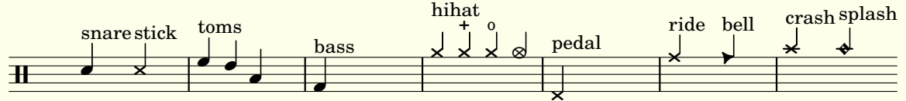

# Lilypond drums music scores

This is my small and modest collection of drums scores.

They are written using [Lilypond](https://lilypond.org/) and the GUI app [Frescobaldi](https://frescobaldi.org/):
I prefer this way of writing scores compared to traditional ones like TuxGuitar or MuseScore: WYSIWYM beats WYSIWYG!

## Drums style

My current drums style notation is

You can adapt it to your needs or taste by editing `lib/drums_style.ly`.
